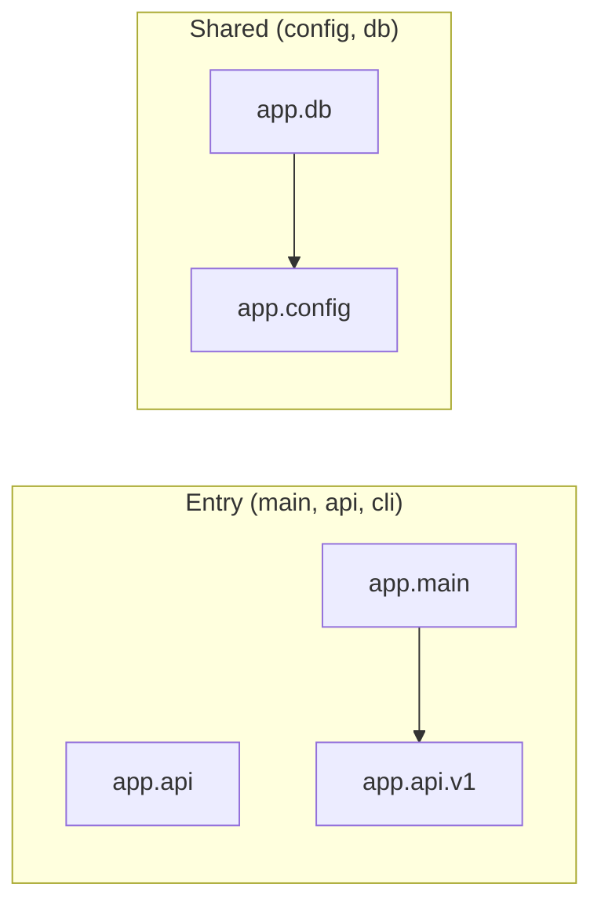

# Backend Dependency Graph

Generated by `python utils/dep_graph.py --graph`. Do not edit by hand.

6 modules, 2 import edges.

```mermaid
flowchart LR
  subgraph entry["Entry (main, api, cli)"]
    app_api["app.api"]
    app_api_v1["app.api.v1"]
    app_main["app.main"]
  end
  subgraph core["Shared (config, db)"]
    app_config["app.config"]
    app_db["app.db"]
  end
  app_db --> app_config
  app_main --> app_api_v1
```

## Rule check

All dependency rules pass.
